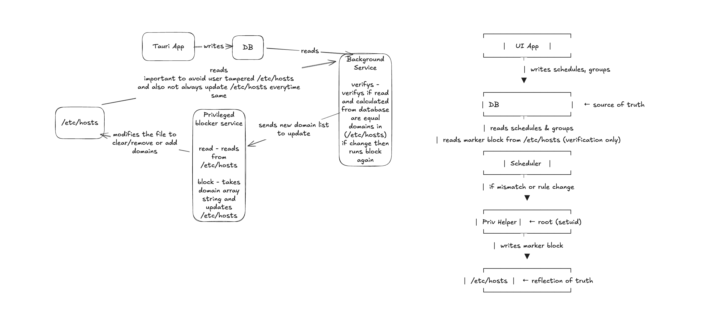

# Initial Idea
I wanted a blocker that could block groups of sites on a schedule, not just a full blackout.
SelfControl helps with complete blocks for a time for hours or days. 

Core requirements where:
- scheduled blocking
- different groups of websites/domains
- no repeaded sudo prompts
- weekly multi-day schedules.

I thought, it would be simple - just edit `etc/hosts` file like other apps do.
But I soon realized the hosts file is protected and editing it usually requires root access or a system password.

Apps like SelfControl ask entering password whenever we want to start blocking.
Scheduling means the app would run in the background, so it can't ask me with prompts every time a new schedule is beginning.
Running complete app in sudo is not a good idea.

Then with taking to chatgpt, I found that we can create a service (a simple cli commandline tool) that could have sudo access. And app can call that service to do operations `etc/hosts` file.
I also worried about what happens when the app closes or the system reboots or user directly tampers with `etc/hosts` file, which could shut down blocking.
Then i already have seen how service is written in rust thought of developing a simple architecture.

### Architecture

### Tech Stack:
I had heard of Tauri long time ago and people said it is better choice than Electron. So I had to try.
Most of the coding was "vibe coding" since I hadn't written Rust before, but I could understand enough to fix bugs and shape the design.
This is simple idea and simple solution and it will work somehow. We can add more features later but this base is good enough for now. 

### Future things we can add

- Have support for windows, linux, android, ios too
- Similar to how wire shark sees the traffic, we can get that data and show statics on what sites user spent time and patterns of usage of days, months, years.
- Have multiple schedules for same group
- Instead of block list we can have allow list only allowed sites will be allowed
- Can also have same feature has selfcontrol where we can block websites for time/days
- If able to figure out how to block apps and all then add that too.